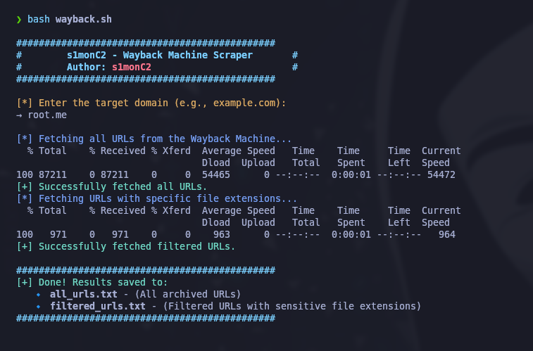

# 🕵️‍♂️ Wayback Machine Scraper

A Bash script to extract **archived URLs** and **sensitive file paths** from the Wayback Machine (web.archive.org) for any target domain.

Made for **bug bounty hunters**, **pentesters**, and **OSINT enthusiasts**.

---

## ⚡ Features

- 🎯 Collects all archived URLs for a given domain
- 🧠 Filters for juicy file types (e.g., `.sql`, `.json`, `.pdf`, `.env`, `.yml`, etc.)
- 💾 Saves results to `all_urls.txt` and `filtered_urls.txt`

---

## 🧪 Example Usage

```bash
chmod +x wayback.sh
./wayback.sh
```

### 📸 Screenshot

Here's a sample terminal output:



## ⚠️ Disclaimer

This project is intended for **educational and authorized penetration testing purposes only**.

The author does **not condone** or support any illegal activity or unauthorized access to systems.  
You are solely responsible for ensuring you have proper permission before running any part of this code against any target.

By using this tool, you agree that:
- You have explicit permission to test the target systems.
- You will not use this tool for malicious or illegal purposes.
- The author is **not liable** for any misuse or damage caused.

**Use responsibly. Hack the planet... legally.**
